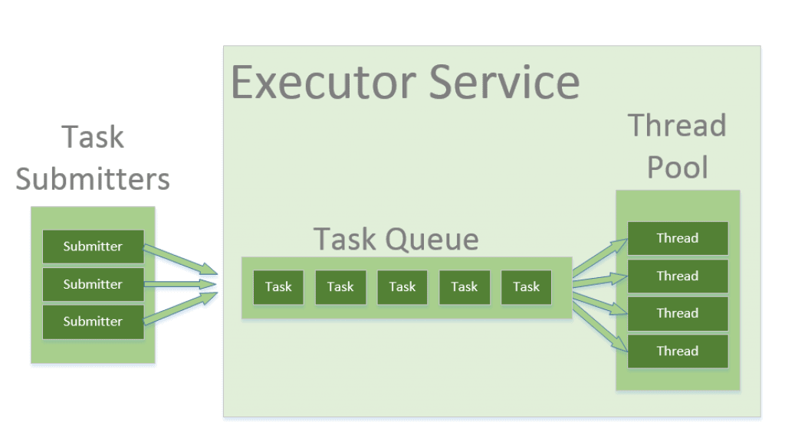

스레드 풀은 미리 만들어진 재사용 가능한 스레드들의 그룹이다. 테스크가 들어오면 풀 내에 존재하는 idle한 스레드에 할당된다. 만약 모든 스레드가 사용중이라면, 사용 가능한 스레드가 나타날 때 까지 Queue에서 대기한다.



[이미지 출처](https://www.baeldung.com/thread-pool-java-and-guava)

### 스레드 풀을 사용하는 이유

1. 오버헤드 감소

   스레드는 한 번 생성돼서 재사용되기 때문에 스레드의 생성과 파괴에 드는 오버헤드를 줄일 수 있다.

2. 리소스의 효율적인 관리

   스레드의 개수를 제한함으로써 과도한 스레드 생성을 방지할 수 있다.

3. 속도 향상

   스레드는 재사용되기 때문에 조금 더 빨리 테스크가 처리될 수 있다.

### 스레드 풀은 언제 사용해야할까?

웹 서버에서 처리해야하거나 수명이 짧은 많은 작업을 잘 관리해야 하는 시라니오에서 유용하다.

### Java에서 스레드 풀을 구현하는 방법

`java.util.concurrent` 패키지를 이용할 수 있다.

1. 스레드 풀 만들기

Java에서 스레드 풀을 만들기 위해 `Executors` 클래스를 사용한다.

```java
import java.util.concurrent.ExecutorService;
import java.util.concurrent.Executors;

public class ThreadPoolExample {
    public static void main(String[] args) {
        // Create a fixed thread pool with 5 threads
        ExecutorService executorService = Executors.newFixedThreadPool(5);

        for (int i = 0; i < 10; i++) {
            Runnable task = new Task(i);
            executorService.execute(task);
        }

        executorService.shutdown();
    }
}

class Task implements Runnable {
    private int taskId;

    public Task(int taskId) {
        this.taskId = taskId;
    }

    @Override
    public void run() {
        System.out.println("Task " + taskId + " is being executed by " + Thread.currentThread().getName());
    }
}
```

2. 서로 다른 타입의 스레드 풀 이용하기

자바에서는 서로 다른 시나리오에 대응할 수 있는 스레드 풀 타입들을 제공한다.

(1) 단일 스레드 생성

테스크를 순차적으로 처리하기 위한 스레드 풀을 생성한다.

```java
ExecutorService singlePool = Executors.newSingleThreadExecutor();
```

(2) 스레드의 개수를 고정하여 생성하는 경우

스레드가 모두 busy 한 경우, 태스크는 큐에 들어간다.

```java
ExecutorService fixedPool = Executors.newFixedThreadPool(10);
```

(3) 캐싱 가능한 스레드 풀

필요하면 스레드를 생성하나, 이전에 생성된 스레드도 사용이 가능하다.

```java
ExecutorService cachedPool = Executors.newCachedThreadPool();
```

(4) 스케쥴링 가능한 스레드 풀

특정 시간이 지난 후에 혹은 주기적으로 실행할 수 있는 스레드 풀을 만든다.

```java
ScheduledExecutorService scheduledPool = Executors.**newScheduledThreadPool**(5);
```

### 스레드 풀의 Best Practices

1. 스레드 풀 사이즈 잘 선택하기

I/O Bound한 테스크들은 풀이 커야겠지만, CPU Bound한 태스크들은 프로세서의 개수와 동일한 풀 사이즈를 만드는 것이 이득일 수 있다.

2. 항상 스레드 풀을 종료하라

`shutdown()`혹은 `shutdownNow()`를 이용하여 적절하게 리소스를 삭제할 수 있다.

3. 블록킹 작업은 피하라

테스크 내에 블록킹하는 작업은 피하여 스레드 기아를 막을 수 있다.

4. 모니터링하라

스레드 풀의 성능을 모니터링하고 사이즈를 조절해라

### References

[Java Thread Pool: How to Efficiently Manage Threads | by Anh Trần Tuấn | tuanhdotnet | Medium](https://medium.com/tuanhdotnet/java-thread-pool-how-to-efficiently-manage-threads-4fb8c1edb113)
